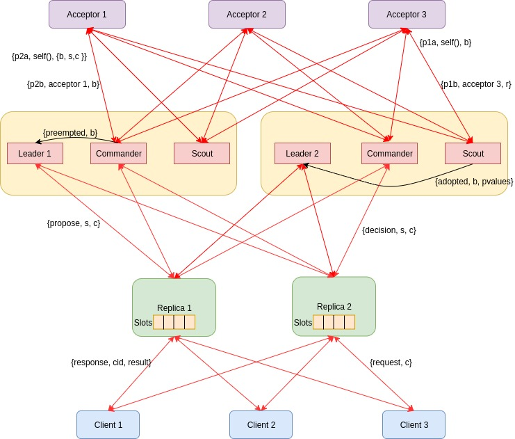

# Multi-paxos

This is an Elixir implementation of the Paxos protocol, used to solve consensus
in a network of processes that is fault tolerant.

The protocol can run on either a single Elixir node or in a network of nodes,
each running in its own Docker container.

The following diagram descibes the system architecture what messages are
exchanged between different Elixir components.

# compile and run options

make compile	- compile
make clean	- remove compiled code

make run	- run in single node 
make run SERVERS=n CLIENTS=m CONFIG=p
                - run with different numbers of servers, clients and 
                - version of configuration file, arguments are optional

make up		- make gen, then run in a docker network 
make up SERVERS=<n> CLIENTS=<m> CONFIG=
 

make gen	- generate docker-compose.yml file
make down	- bring down docker network
make kill	- use instead of make down or if make down fails
make show	- list docker containers and networks

make ssh_up	- run on real hosts via ssh (omitted) 
make ssh_down	- kill nodes on real network (omitted)
make ssh_show	- show running nodes on real network (omitted)

